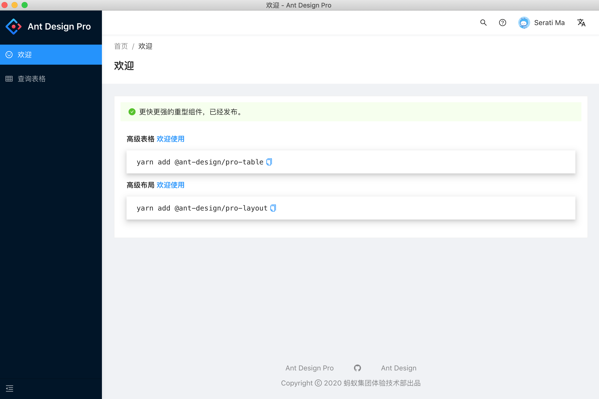
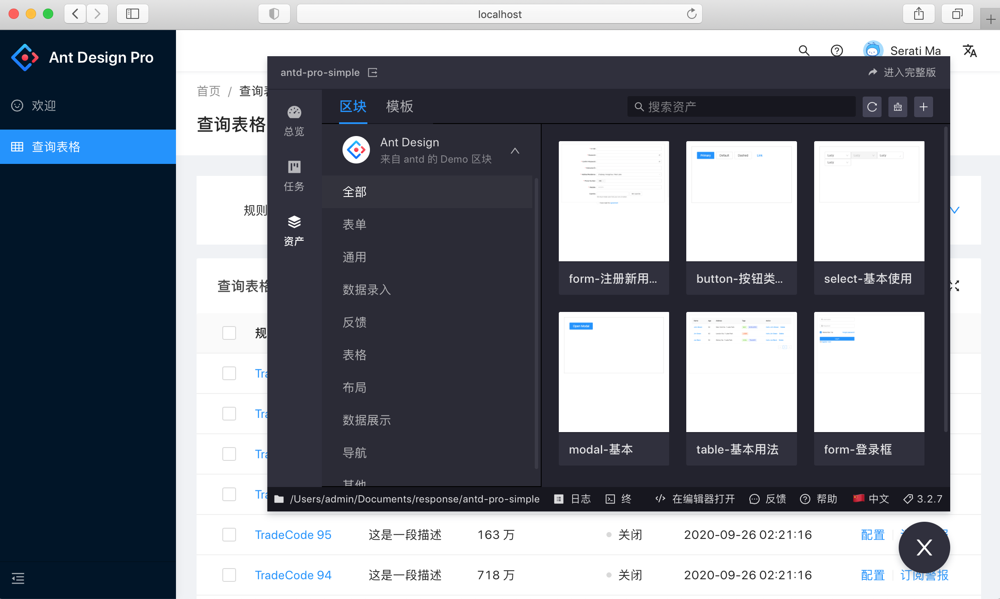

# electron-antd-template




基于 web 的 electron + ant-design-pro 桌面客户端模板。为了便于打包，本模板中使用的 Golang 的 web 服务，可自由替换为其他语言。

## 功能

- 支持热更新
- 同时支持 web 打包和桌面应用打包
- 支持桌面应用打包 mac、linux、win
- 支持 umi-ui 自动添加组件
- ant-design-pro@^4.x

## 项目结构

```
.
|-- build
|   |-- icon.icns                         # 打包后 MacOS 程序图标
|   |-- icon.ico                          # 打包后 Windows 程序图标
|   |-- webpack.base.config.js            # electron-webpack 基础配置
|   |-- webpack.main.config.js            # electron-webpack 开发配置
|   `-- webpack.main.prod.config.js       # electron-webpack 正式配置
|-- config
|   |-- routes                            # 路由配置目录
|   |   `-- index.js                      # 路由配置
|   |-- server                            # 服务端配置目录，如果有文件，打包时，会复制到根目录下的 config 目录
|   |-- licenseSettings.js                # 授权码相关配置
|   `-- config.js                         # umijs 配置
|-- main
|   `-- main.js                           # 主程序入口
|-- dist                                  # 项目编译输出目录
|   |-- main                              # 主程序编译目录
|   `-- renderer                          # 页面编译目录
|-- mock                                  # 本地模拟数据
|-- public                                # 静态资源目录
|   `-- renderer.js                       # 如果需要引用 node 的 api，需要在这个 js 里面提前引入
|-- release                               # 打包输出目录
|-- src                                   # 开发目录
│   |-- assets                            # 本地静态资源
│   |-- components                        # 业务通用组件
│   |-- e2e                               # 集成测试用例
│   |-- layouts                           # 通用布局
│   |-- models                            # 全局 dva model
│   |-- pages                             # 业务页面入口和常用模板
│   |-- services                          # 后台接口服务
│   |-- utils                             # 工具库
│   |-- locales                           # 国际化资源
│   |-- global.less                       # 全局样式
│   `-- global.ts                         # 全局 js
|-- tests                                 # 测试工具
|-- package.json                          # 项目依赖以及打包配置
`-- README.md                             # 项目说明文档
```

## 环境搭建

### 安装

然后通过 yarn 下载依赖

```shell
yarn
```

### 开发

```shell
yarn start
```

### 如何使用 node 的 api

需要在 /public/renderer.js 中引入相关的 api，例如 electron 依赖

### 打包

```shell
# 打包桌面应用
yarn build

# 打包web版本
yarn build:renderer
```

### 打包配置说明

[package.json 说明](./package.json)

[electron-builder 参数参考](https://www.electron.build/configuration/configuration)

[category-Mac 分类参考](https://developer.apple.com/library/ios/documentation/General/Reference/InfoPlistKeyReference/Articles/LaunchServicesKeys.html#//apple_ref/doc/uid/TP40009250-SW8)

### 依赖包相关目录

- electron 的下载目录

  https://npm.taobao.org/mirrors/electron

  - Linux: `$XDG_CACHE_HOME` or `~/.cache/electron/`

  - MacOS: `~/Library/Caches/electron/`

  - Windows: `$LOCALAPPDATA/electron/Cache` or `~/AppData/Local/electron/Cache/`

- electron-builder 的下载目录

  https://github.com/electron-userland/electron-builder-binaries/releases

  同上的缓存路径 `{cache_path}/electron-builder/`

  依赖：appimage fpm linux nsis snap winCodeSign wine

---

### npm/yarn 配置命令

```shell

# 第一次安装需要的依赖
npm install --save-dev electron-rebuild

# mac 
brew install pkg-config cairo pango libpng jpeg giflib librsvg
```

### web 服务端

本模板默认 web 服务端是使用 `golang` 。 打包后软件启动时，默认会启动 `server` 子进程。所以，在执行 `yarn build` 打包
之前，需要将 web 服务端打包成 server 可执行文件（win下为 server.exe），并复制到根目录下。

如果，您不需要启动 web 服务端，请修改 [`serverSettings.js`](./config/serverSettings.js) 将其禁用即可。
或，通过修改 [`main.js`](./main/main.js) 来定制。


## 和 antd.Pro 的差异

### request.js

[`request.js`](./src/utils/request.js) 默认封装了 Restful API 的请求头、响应错误码。

### 授权码模块

当请求响应头中返回 `X-Error-Code` 等于 `1438` 时，自动跳转授权页面；相关封装代码见 [`request.js`](./src/utils/request.js)

### 用户鉴权模块
1. 修改用户鉴权模块
